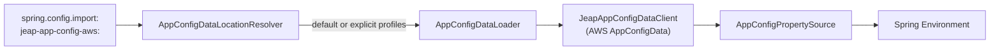

# AWS AppConfig integration

AWS AppConfig (part of AWS Systems Manager) stores and deploys application configuration. The starter
imports AppConfig configuration profiles into the Spring `Environment` as property sources. It hooks
into Spring Boot's `ConfigData` mechanism through `AppConfigDataLocationResolver` and
`AppConfigDataLoader`, both registered in `META-INF/spring.factories`.

## Enabling the import

Add the `jeap-app-config-aws:` location to `spring.config.import` and set the AppConfig environment:

```yaml
spring:
  config:
    import: "jeap-app-config-aws:"
jeap:
  config:
    aws:
      appconfig:
        env-id: dev
```

See [Configuration reference](configuration.md) for all `jeap.config.aws.appconfig.*` properties.

## How loading works



For each resolved profile the loader builds a `JeapAppConfigDataClient`, which starts an AppConfig
configuration session and fetches the latest configuration. The payload is parsed by content type:
`application/x-yaml` (YAML), `application/json` (JSON), and otherwise as a Java properties string.
The resulting properties become an `AppConfigPropertySource` in the environment.

## Default profile layout

When the location is the bare prefix `jeap-app-config-aws:` (no explicit profiles), the starter loads
these profiles, each named `config`, in order — later profiles override earlier ones:

| Order | AppConfig application                         | Mandatory | Notes                                                                   |
|-------|-----------------------------------------------|-----------|-------------------------------------------------------------------------|
| 1     | `common`                                      | yes       | System-wide configuration; skip with `no-default-common-config=true`    |
| 2     | `common-certs`                                | optional  | Signing certificates for jEAP Messaging; no error if absent             |
| 3     | `common-platform`                             | yes       | Platform-wide configuration; skip with `no-default-common-platform-config=true` |
| 4     | `${spring.application.name}`                  | yes       | The microservice's own configuration                                    |

The profile name is always `config` (constant `STANDARD_APP_CONFIG_PROFILE_NAME`).

## Explicitly specifying profiles

Instead of the defaults you can list profiles explicitly as a semicolon-separated list of
`<app-name>/<profile-name>` pairs after the prefix. Profiles load in order; later ones override
earlier ones. When profiles are specified explicitly, no automatic `common`/`common-platform` import
happens.

```yaml
spring:
  config:
    import: "jeap-app-config-aws:common/config;common-platform/config;my-service/config"
```

Each argument must match the pattern `<app-name>/<profile-name>`; an invalid argument fails startup
with a `ConfigDataInvalidLocationArgumentException`. A mandatory profile that cannot be loaded fails
startup; mark a location `optional:` to ignore a missing profile, e.g.
`optional:jeap-app-config-aws:my-service/config`. Explicit profiles should be reserved for special
cases — the bare `jeap-app-config-aws:` prefix is the norm.

## Related

- [Configuration reference](configuration.md)
- [Dynamic configuration refresh](dynamic-refresh.md)
- [Getting started](getting-started.md)
- [jeap-spring-boot-config-aws-starter](../README.md)
