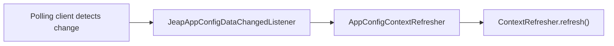

# Dynamic configuration refresh

For AppConfig profiles, the starter keeps polling AWS after startup and refreshes the Spring
application context when a new configuration version is deployed. This is built on Spring Cloud
Context's `ContextRefresher`. (Secrets Manager imports are read once at startup and are not polled.)

## Polling

Each `JeapAppConfigDataClient` runs a daemon `ThreadPoolTaskScheduler`
(`jeap-aws-appconfig-polling-scheduler-`) that re-fetches the latest configuration on an interval.
The interval comes from AppConfig's `nextPollIntervalInSeconds` response, falling back to
`required-minimum-poll-interval-in-seconds` (or 60 seconds if unset). `JeapAppConfigDataClientFactory`
reuses one client per `profile-env-app` combination so that only a single AppConfig session is open
per profile. When AppConfig returns an empty payload the configuration is treated as unchanged and no
refresh happens.

## Refresh flow

`AppConfigContextRefresher` (a bean from `JeapAWSAppConfigAutoConfig`) registers itself as the
`JeapAppConfigDataChangedListener` on every `AppConfigPropertySource` backed by a
`JeapAppConfigDataClient`. When a polled profile changes it calls `ContextRefresher.refresh()`.

## What gets refreshed

A refresh re-binds, without restarting the application:

- the Spring `Environment` of the application context
- `@ConfigurationProperties` beans
- beans annotated `@RefreshScope`
- feature flags based on the `jeap-spring-boot-featureflag-starter`

Plain singleton beans that captured a value at construction time are **not** re-injected — use
`@ConfigurationProperties` or `@RefreshScope` for values that must change at runtime.

## Related

- [AWS AppConfig](appconfig.md)
- [Configuration reference](configuration.md)
- [jeap-spring-boot-config-aws-starter](../README.md)
